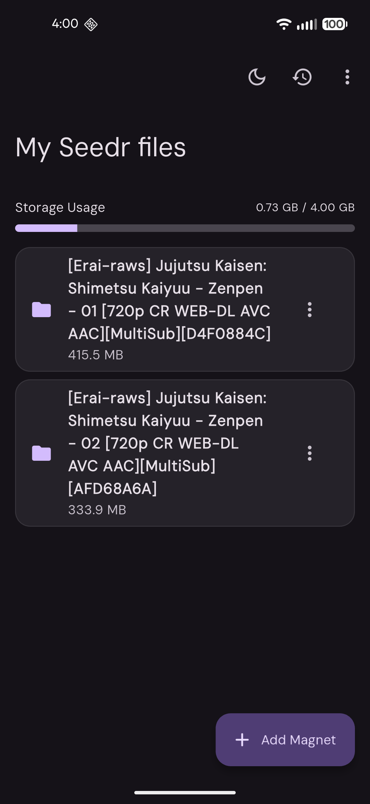

# Seedr

A Flutter application for streaming and downloading torrents efficiently across Android and iOS platforms.

## 📱 Screenshots

<table>
  <tr>
    <td></td>
    <td></td>
  </tr>
</table>

## ✨ Features

- 🔐 User authentication and login
- 🧲 Add and manage magnet links
- 📊 Real-time torrent downloads and streaming
- 📝 Comprehensive logging system
- 🎨 Clean and intuitive UI
- 📱 Cross-platform (Android & iOS)
- ⚙️ User settings and preferences

## 🚀 Getting Started

### Prerequisites

- Flutter SDK 3.38.1 or higher
- Android SDK (for Android development)
- Xcode (for iOS development)
- Java 21+

### Installation

1. **Clone the repository**
   ```bash
   git clone https://github.com/anjanamadu/seedr.app.git
   cd seedr.app
   ```

2. **Get dependencies**
   ```bash
   flutter pub get
   ```

3. **Run the app**
   ```bash
   flutter run
   ```

### Building for Release

#### Android
```bash
# Build APK
flutter build apk --release

# Build App Bundle (for Play Store)
flutter build appbundle --release
```

#### iOS
```bash
# Build for iOS (requires code signing)
flutter build ios --release
```

## 📁 Project Structure

```
lib/
├── main.dart                 # App entry point
├── models/
│   └── seedr_models.dart    # Data models
├── service/
│   ├── logging_service.dart # Logging functionality
│   ├── seedr.dart           # Main service logic
│   └── settings_service.dart # Settings management
└── ui/
    ├── add_magnet_dialog.dart # Magnet addition UI
    ├── home_screen.dart      # Home screen
    ├── log_screen.dart       # Logs display
    └── login_screen.dart     # Authentication
```

## 🔧 Configuration

### Permissions

**Android** (`android/app/src/main/AndroidManifest.xml`):
- `INTERNET` - Network access
- `ACCESS_NETWORK_STATE` - Network state monitoring

**iOS** (`ios/Runner/Info.plist`):
- Network access via App Transport Security configuration

## 🔄 CI/CD

This project includes GitHub Actions workflows for automated building and releases:

- **Build & Release Workflow** (`.github/workflows/build-and-release.yml`)
  - Automatically builds APK, App Bundle, and IPA on every commit
  - Creates releases with build artifacts
  - Triggers on pushes to `main` and `master` branches

## 📚 Resources

- [Flutter Documentation](https://docs.flutter.dev/)
- [Flutter Cookbook](https://docs.flutter.dev/cookbook)
- [Dart Language Guide](https://dart.dev/guides)

## 📄 License

This project is licensed under the MIT License.

## 👤 Author

Anjana

## 🤝 Contributing

Contributions are welcome! Please feel free to submit a Pull Request.
